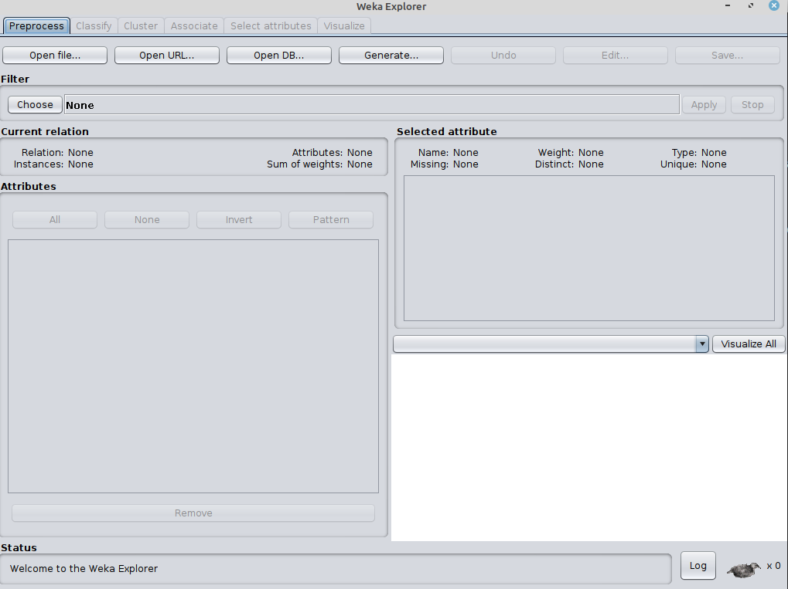
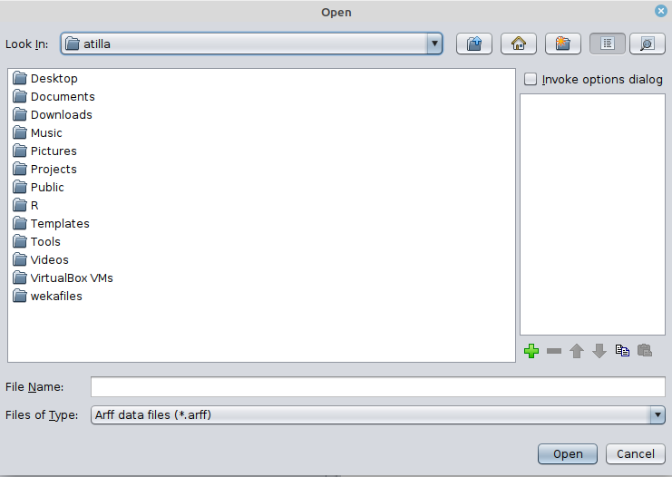
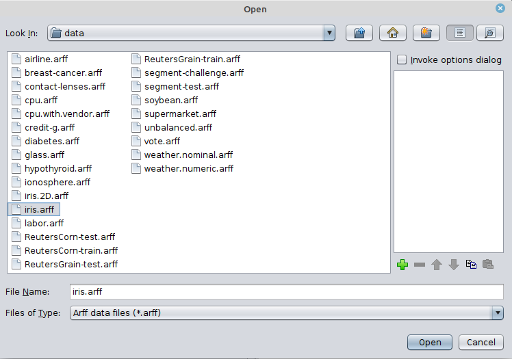
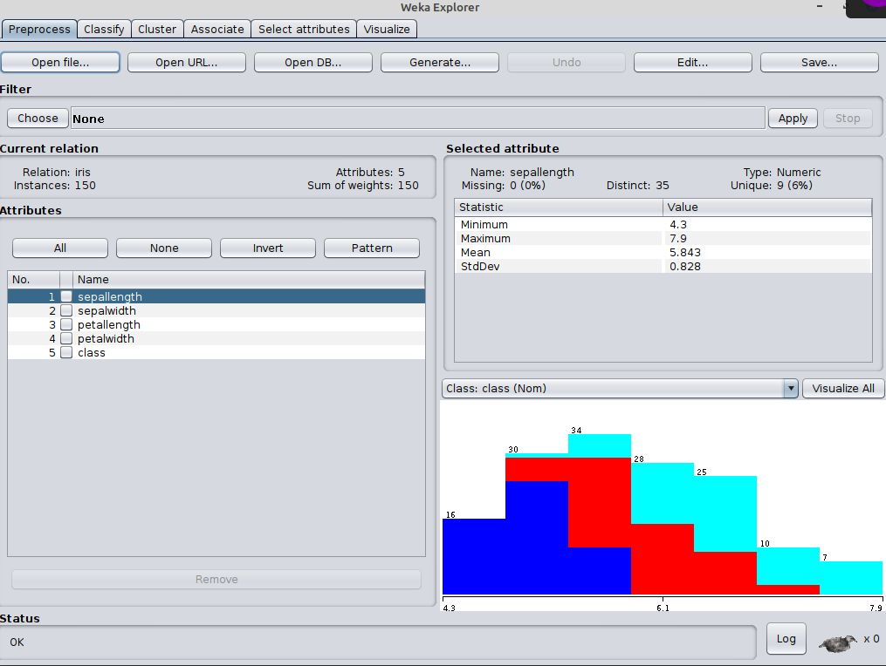
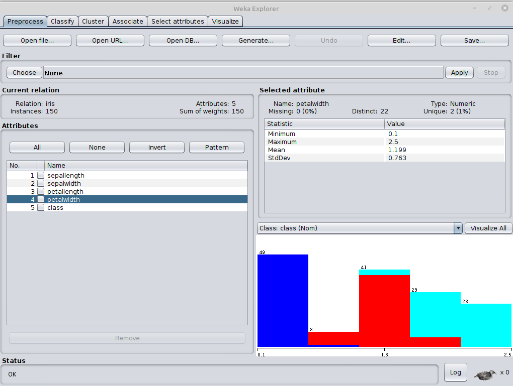
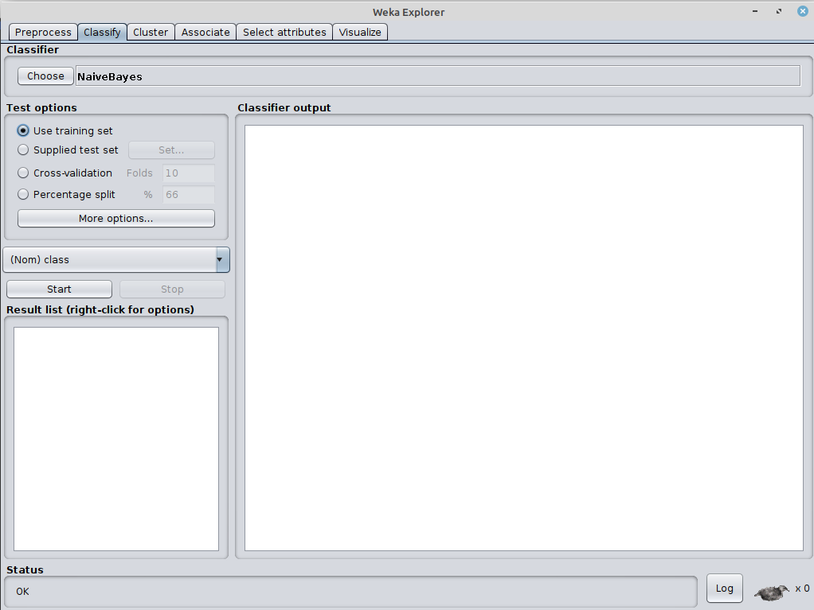

# Simple classification example on iris dataset using weka

1. [install weka](../installation-weka.md) on your computer

2. Read [iris dataset](iris.md) page and download iris.arff file 

3. open weka in one of the following ways

	- using shortcut 
	- in command line java -jar weka.jar

4. You need to see Weka GUI chooser

5. Open Explorer by clicking explorer button

6. From Preprocess tab click open file and load iris dataset

7. You should see iris data set loaded to your workbench

8. In the attributes tab choose different attributes and 

	- see how their statistical summaries change in the selected attribute window part
	- see how their histograms change in the visualization window part

See an example for petal width below.

9. Goto classify tab

- select classifiers->bayes->naive bayes
- from **test options** select use training set
- click run

10. you should see the run results in the **classifier output** window part.
Most important parts for now is 

	- Correctly Classified Instances 
	- Incorrectly Classified Instances    
	- Confusion matrix

11. from **test options** select Percentage split and use %60 for value. Click start again.

12. How the following values are changed? Can you guess why?
	- Correctly Classified Instances 
	- Incorrectly Classified Instances    
	- Confusion matrix

13. from classifier choose Functions->MultiLayerPerceptron and click start

14. Click MultilayerPerceptron beside the choose button, you will see hyper parameters of MultilayerPerceptron algorithm.
Change hidden layers parameter from a to 3 and click ok.
Then click start again.

15. from classifier try with following classifiers

	- Functions
		- Logistic (Logistic regression)		
		- MultiLayerPerceptron (Feed forward Neural Network)
	- lazy
		- 1BK (K-nearest neighbor)
	- meta
		- AdaboostM1
		- Bagging
		-
	- rules
		- decision table
		- OneR
		- ZeroR
	- trees
		- J48
		- Random forest

We will learn how they work for most of these classifiers in our class.

