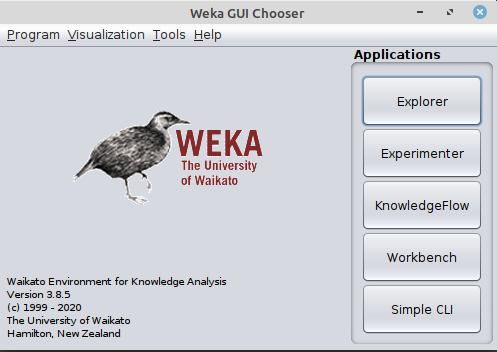

# Simple classification example on iris dataset using weka

1. [install weka](../installation-weka.md) on your computer

2. Read [iris dataset](iris.md) page and download iris.arff file 

3. open weka in one of the following ways

	- using shortcut 
	- in command line java -jar weka.jar

4. You need to see Weka GUI chooser

5. Open Explorer by clicking explorer button

6. From Preprocess tab click open file and load iris dataset

7. You should see iris data set loaded to your workbench

8. In the attributes tab choose different attributes and 

	- see how their statistical summaries change in the selected attribute window part
	- see how their histograms change in the visualization window part

See an example for petal width below.

