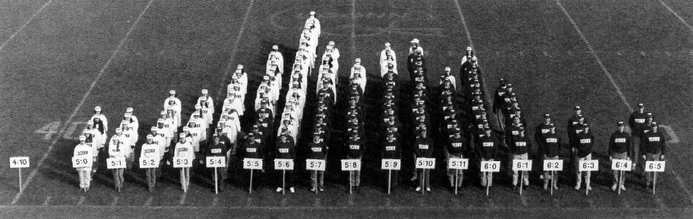

# Visualizations or Graph (figure) types

###  Line graph

Use a line graph to track changes over periods of time.
Bar graphs can also be used for same purpose but if variable number is higher than two, line graph is better.
Line graphs could be a better choice for data which has maximum and minimum points.
In addition, since line graphs connects points, data perceived as continuous.

#### Examples 

- Monthly sales contributions of different departments in 2020.

###  Pie chart

Use it when trying to compare parts of whole thing. 
Pie charts should be used for a data in a point of time.
They are not suitable for a changes over a period of time.

#### Examples 

- sales contribution of different departments in 2020.
- budget percentages of different departments in 2020.

### Bar Graph

Similar to line graph, it is used to track changes of periods of time.
But it is better when changes are larger and compared entities are less than three.
Bar charts are useful for highlighting differences between categories.
Bar charts could be vertical or horizontal.

#### Examples 

- Monthly sales contributions of different departments in 2020.
- Employee counts of different departments 
	- may be Sales department employee count vastly outnumbers R&D in this figure.

### Histograms

Histograms are subset of bar graphs. They are very useful to visualize distributions.

### X-Y Plot 

X-Y plot could be different plots like scatter and line plots.
If data is continuous, line plots could be used, otherwise scatter plots should be used.
Use it to determine relationships between X and Y.
Do they increase or decrease together.

#### Examples 

- weight vs height of survey participants
- salary vs age of participants

### Area Graph

Similar to line graphs, they are used to track changes over time.
They could be a better choice when two parts of whole compared over time.

#### Examples 

- Monthly sales contributions of two departments in 2020.

### Maps

Maps are choice of graph for location information.

#### Examples 

- Sales contributions of locations.

### Tables

Tables are useful for showing exact data.
Most of the time, trends and relationships are given as visualizations and exact data is given as a table.

### Reports to look at

- https://www.kaggle.com/kaggle-survey-2020
- https://insights.stackoverflow.com/survey/2020
- https://ctl.mit.edu/sites/ctl.mit.edu/files/2020-09/State_Supply_Chain_Sustainability_MIT_CTL_CSCMP_0.pdf

### Examples figures in R

- [Quickly Exploring Data in R Graphics Cookbook, 2nd edition](https://r-graphics.org/chapter-quick)

### links to read

- https://nces.ed.gov/nceskids/help/user_guide/graph/whentouse.asp
- https://www.tableau.com/learn/whitepapers/which-chart-or-graph-is-right-for-you
- https://www.intellspot.com/types-graphs-charts/
- https://infogram.com/blog/do-you-know-when-to-use-tables-vs-charts/

### R Visualization

- [ggplot main help](https://ggplot2.tidyverse.org/)
- [ggplot2 cheatsheat](https://raw.githubusercontent.com/rstudio/cheatsheets/master/data-visualization.pdf)
- [introverse help for ggplot2](https://spielmanlab.github.io/introverse/articles/introverse_online.html)

